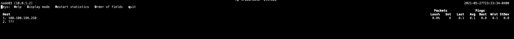

 # 自己动手实现一个能跨主机通信的network-namespace

## 前言
这篇文章将向大家介绍容器网络涉及到的网络虚拟化技术--network-namespace,以及如何自己动手实现一个能够跨主机通信的“虚拟网络空间”。

开始之前，先思考以下几个问题：
*  docker创建的容器虚拟网络是怎么实现的？
*  同一台主机上docker的容器之间是怎么实现通讯的？
*  主机上的docker容器如何能被其他主机通过容器IP访问到？
带着这些问题我们开始今天的动手实践。

## 基本概念
* 什么是network-namespace？
  * Network Namespace是Linux内核提供的功能，是实现网络虚拟化的重要功能
  * 它能创建多个隔离的网络空间，它们有独自网络栈信息
  * 不管是虚拟机还是容器，运行的时候仿佛自己都在独立的网络中，而且不同Network Namespace的资源相互不可见
  * 比较常见的应用--docker容器网络的实现
    * 通过在主机系统中创建network-namespace，实现在系统中创造出“虚拟的网络节点”。在“虚拟的网络节点”中，可以拥有独立的网卡、路由、iptables规则等网络相关资源
    * 我们平时直接在host主机上执行的命令所在的空间，也可以认为是一个独立的命名空间，对网路的相关操作也仅针对在host主机网络命名空间的资源
* veth pair-虚拟网卡对
  * 全称是Virtual Ethernet Pair，是一个成对的端口，所有从这对端口一端进入的数据包都将从另一端出来，反之也是一样
    * 无法单独存在，删除其中一个，另一个也会自动消失
  * 为了在不同的Network Namespace直接进行通信，利用它可以直接将两个Network Namespace连接起来
  * 可以充当 network namespace之间的通道，也可以作为独立的网络设备使用
* 路由表
  * 主要工作就是为经过路由器的每个数据包寻找一条最佳的传输路径，并将该数据有效地传送到目的站点。
  * 表中包含的信息决定了数据转发的策略。
    * 路由表就像我们平时使用的地图一样，标识着各种路线，路由表中保存着子网的标志信息、网上路由器的个数和下一个路由器的名字等内容
  * 可以由系统动态修改，可以由路由器自动调整，也可以由主机控制
* iptables组件
  * iptables组件其实不是真正的防火墙，可以把它理解成一个客户端代理，用户通过iptables这个代理，将用户的安全设定执行到对应的”安全框架”中，这个”安全框架”才是真正的防火墙，这个框架是netfilter(位于内核空间)
  * 通过iptables可以实现对数据包的处理--封包过滤、封包重定向和网络地址转换（NAT）等功能
  * iptables中设定的包处理规则最终会决定数据包是否可以抵达协议栈或是直接被阻止、丢弃掉；在匹配规则的过程中也会用到路由表中的信息

## 动手创建一个network-namespace
* 准备一台linux主机(node03--100.100.198.250),检查"ip"命令是否有效(如果没有需要安装iproute2)
* 执行以下命令创建一个新的net-ns--demo01
```bash
    ip netns add demo01     #创建demo01
    ip netns list           #查看结果,返回中包含"demo01(id:xxx)",说明创建成功
```
* 查看demo01下的网卡资源
  * 通过第一条命令可以看到该namespace下只有一块lo网卡，且该网卡是关闭状态(可以在host主机网络空间直接执行"ip addr"观察两者区别)
  * 通过第二条命令可以开启该网卡
  ```bash
      ip netns exec demo01 ip addr   #ip netns exec demo01 <需要执行的命令>可以实现对demo01的相关操作，也可以通过“ip netns exec demo01 /bin/bash”进入到demo01的虚拟网络环境中之后，再直接通过执行命命令的方式操作；操作完成需要退出至主机网络空间，需执行exit
      ip netns exec demo01 ip link set lo up   #开启lo网卡,lo网卡自动绑定127.0.0.1
  ```
  
* 至此，一个新的network-namespace demo01已经创建完成
  * 目前demo01只具有本地lo网卡，那该如何实现与host主机网络空间通信呢？

### 为demo01配置网卡对和路由
* 在之前的基本概念里可以了解到，不同的namespace间的通讯需要依赖虚拟网卡对
  * 实现demo01与host主机网络空间通信，也可以理解成两个独立的network-namespace之间通讯
  * 所以我们要创建一个网卡对，且把两端分别放在host主机网络空间和demo01中，并启动网卡
  ```bash
      ip link add vethhost01 type veth peer name vethdemo01    #创建虚拟网卡对    ip link add <网卡名称> type veth peer name <配对的网卡名称>
      ip addr                                                  #可以看到host主机网络空间下多了两张新建的网卡
  ```
  
  ```bash
      ip link set vethdemo01 netns demo01                      #将虚拟网卡vethdemo01分配到demo01中   ip link set <网卡名称> netns <net-ns名称> 
      ip link set vethhost01 up                                #开启host主机网络空间端的网卡
      ip netns exec demo01 ip link set vethdemo01 up           #开启demo01端的网卡,至此可以两张网卡已全部开启，并且分别在两个网络命名空间下
  ```
* 要实现通讯，还需要给demo01的网卡一个IP地址(host主机网络空间下的网阿卡vethhost01这里不需要设置IP)
```bash
    ip netns exec demo01  ip addr add 10.0.1.2/24 dev vethdemo01     #将vethdemo01的IP设置为10.0.1.2(地址可以随便设置，只要不与主机网络同一网段即可)   添加IP的命令格式-- “ip addr add <IP地址/子网掩码> dev <网卡>”
```

* 设置好IP是不是就能实现通讯呢？比如ping通？
  * 验证
    * 可以从在host主机网络空间直接“ping 10.0.1.2/24”，结果--并无响应，数据包全部丢失，通过mtr发现数据流向了主机的默认网关
    * 也可以从demo01反向”ping 100.100.198.250“，结果--”connect: Network is unreachable“
  * 通过路由命令”ip r“，检查路由
    * 观察发现host主机网络空间路由表中并没有包含10.0.1.2的相关路由
    * 观察发现demo01路由表中只有同一网段”10.0.1.0/24“的路由，没有其他信息，也没有默认的路由网关
      * 目的路由和默认路由网关都没有，所以demo01的内核并不知道该如何处理数据包，所以直接丢弃，也是和host主机网络空间从发起ping的结果不一样的原因
      * 从host主机网络空间从发起ping之所以一直没返回，是因为主机在包处理时只需按照路由指示把数据包传递给下一跳，之后的链路是否可达，在没收到返回信息之前，主机内核并不能知晓，所以一直无响应
  
* 添加双向路由
  * 要实现能ping通，一定是双向可达的，所以来去两个方向都需要有路由指向才能通信
    * 在host主机网络空间添加通往10.0.1.2的路由指向，将固定IP10.0.1.2指向同一网络空间下的网卡vethhost01(它的对端就是demo01的网卡)
    * 在demo01添加通往100.100.198.250的指向，只需要添加默认路由网关指向自己的网卡vethdemo01(它的对端网卡vethhost01就在100.100.198.252的网络空间下)
  ```bash
      route add -host 10.0.1.2 dev vethhost01                         #host主机网络空间添加-->demo01方向的路由  路由命令 ”route <动作-常用的add或者del> <目标地址类型-常用net或者host> <目标地址，如果是网段必须要加/子网掩码> <下一跳的类型,网卡设备-dev、ip地址-gw> <下一条网卡名称或者ip地址>”    这条路由的规则解读是：当主机收到目的地址是10.0.1.2的数据包，将其转发到本机的vethost1网卡上 
      ip netns exec demo01 route add default dev vethdemo01           #demo01添加默认的路由，这条路由是为了下一条路由能生效
      ip netns exec demo01 route add -net 0.0.0.0 gw 100.100.198.250  #为了演示方便，这条路由是为了将host主机网络空间模拟成路由器的角色；将默认的下一跳指向100.100.198.250，让其转发请求；   这条路由的规则解读是：当主机收到的数据包的目的地址在其他路由规则中匹配不到时，将默认都转发到100.100.198.250
  ```
  * 再次验证，结果证明双向已经互通；
  
* 到这里，一个可以能与host主机网络空间实现通信的network-namespace就已经创建完成了；

### 创建demo02，实现demo01与其互通
* 参照以上步骤我们可以再创建一个network-namespace
  * 命名为demo02
  * IP地址设置为10.0.2.2；
  * 添加双向路由，实现100.100.198.252与10.0.2.2
  
* 以上都实现之后，验证网络联通情况
  * 在host主机网络空间与demo01/02双向互ping
    * 结果都为通
  
  * demo01与demo02互ping
    * 结果--并无响应，数据包全部丢失，通过mtr发现数据流向了主机的默认网关100.100.198.250之后数据包就不知去向；
    * 现象跟之前主机未添加到demo01的路由时很相似，但是目前host主机网络空间存在通往10.0.1.2、10.0.2.2的路由，数据包是可以从100.100.198.250通往demo01/02的；
      * 唯一的不同是这次的数据包原地址是10.0.1.2和10.0.2.2，数据包经过100.100.198.250网卡进行转发；
  
  
  
#### 添加iptables配置
* 已经有了路由，为什么数据包没有被host主机网络空间转发？
  * 这里就要先理解数据包是如何通过内核处理并最终抵达协议栈的
    * 首先需要了解iptables对数据包的处理流程；
  
* 理解什么是“4表5链”
  * 链(报文逻辑走向图中的标红部分，分别是PEROUTING、INPUT、OUTPUT、FORWARD、PEROUTING)
    * 每一条链用通俗的话讲就是一个"关卡"
    * 每一个"关卡"里都可以配置相应的规则
      * 一个“关卡”上可能不止有一条规则，可能有很多条规则，把这些规则串成一个集合的时候，就形成了”链”
      * 每个经过这个”关卡”的报文，都要将这条链上的所有规则匹配一遍，如果有符合条件的规则，则执行规则对应的动作(可能被丢弃，可能被处理之后流向下游，也可能直接流向下游)
  * 表
      * 相同功能的规则的集合叫做”表”，不同功能的规则，我们可以放置在不同的表中进行管理
      * 链中的这些规则基于功能的不同大概分为四类(过滤、网络地址转换、拆解报文\修改\重新封装、关闭连接追踪)
        * filter表：负责过滤功能，防火墙；内核模块：iptables_filter
          * 该类规则可以实现对报文的过滤，限制某些报文无法通行(相关使用场景--防火墙的黑名单功能，禁止某些IP不能访问，或者限制主机对外通信)
        * nat表：network address translation，网络地址转换功能；内核模块：iptable_nat
          * 该类规则可以实现对外发报文中的源、目的地址的转换(相关使用场景--docker的覆盖网络，docker启动的容器对外通信的源地址都不是容器的IP)
        * mangle表：拆解报文，做出修改，并重新封装 的功能；内核模块：iptable_mangle
          * 该类规则可以实现修改数据包的一些标志位，以便其他规则或程序可以利用这种标志对数据包进行过滤或策略路由(相关使用场景--k8s-calico对集群容器网络的policy实现)
        * raw表：关闭nat表上启用的连接追踪机制；内核模块：iptable_raw
          * 该类规则可以实现对报文处理跳过NAT表和ip_conntrack处理,即不再做地址转换和数据包的链接跟踪处理了(相关使用场景--RAW表可以应用在那些不需要做nat的情况下，以提高性能。如大量访问的web服务器，可以让80端口不再让iptables做数据包的链接跟踪处理，以提高用户的访问速度)
  * 表和链的关系
    * 5个“关卡”的职责不同，所以某些链中注定不会包含某类规则
    * 在实际的使用过程中，是通过表作为操作入口，对规则进行定义
      * 在表中添加的规则时需要指定其所在的链
  
* 梳理报文走向(以host主机网络空间为分析对象)
  * 以host主机网络空间主动发起ping为例
    * host主机网路空间-->demo01(发送数据)
      * 当从100.100.198.250主动发起ping时，报文的起始位置在图中的最上层的协议栈
      * 经过路由表判断--用目的地址匹配到路由(如果匹配不到路由，不知道下一条去哪里，那么直接丢弃)，标记数据的下一跳--vethhost01
      * 经过“关卡”OUTPUT检查(4种类型的规则policy默认均为ACCEPT--不阻拦)，由于也没有其他规则，直接流转到下游
      ```bash
          iptables -t raw --line-numbers -nvL OUTPUT        #查看iptables指定表的指定链的相关规则命名 “riptables -t <表名> --line-numbers -nvL <链名称>”  该命令的解读：打印"关卡"OUTPUT的所有raw类型的规则，并能从policy的值获取该类规则集合的默认通行策略
          iptables -t mangle --line-numbers -nvL OUTPUT     
          iptables -t nat --line-numbers -nvL OUTPUT        
          iptables -t filter --line-numbers -nvL OUTPUT     #该链功能最强大，四种类型的功能都有
      ```
      
      * 经过"关卡"POSTROUTING检查(mangle和nat类型的规则policy默认为ACCEPT--不阻拦)，由于也没有其他规则，最终将报文发送给100.100.198.252的网卡enp2s0
      ```bash
          iptables -t mangle --line-numbers -nvL POSTROUTING    #命令使用方式同上，POSTROUTING是网络命名空间的“出口关卡”
          iptables -t nat --line-numbers -nvL POSTROUTING       
      ```
      
      * 网卡enp2s0将报文发送至路由标记的vethhost01，vethhost01会默认将报文流转到自己的网卡对对端--vethdemo01，抵达demo01的内核
    * host主机网路空间<--demo01(接收数据)
      * 当从demo01收到报文并返回应答报文时，应答报文抵达100.100.198.252的网卡enp2s0(报文抵达网卡enp2s0前的过程，就是上述”发送数据“的过程，报文的起始位置就是demo01的协议栈)
      * 内核接受到网卡的报文，先经过“关卡”PEROUTING检查(policy默认为ACCEPT--不阻拦)，由于也没有其他规则，直接流转到下游
      ```bash
        iptables -t raw --line-numbers -nvL PEROUTING         #命令使用方式同上，PEROUTING是网络命名空间的“入口关卡”
        iptables -t mangle --line-numbers -nvL PEROUTING    
        iptables -t nat --line-numbers -nvL PEROUTING       
      ```
      
      * 判断报文目的地址是否是本机(目标地址是本机)
      * 经过“关卡”INPUT检查(policy默认为ACCEPT--不阻拦)，由于也没有其他规则，最终抵达协议栈，ping的发起端接收到返回报文，完成一次完整ICMP通讯
      ```bash
        iptables -t mangle --line-numbers -nvL INPUT         #命令使用方式同上，经过INPUT“关卡”的报文就能进协议栈了
        iptables -t nat --line-numbers -nvL INPUT    
        iptables -t filter --line-numbers -nvL INPUT       
      ```
      
  * 以host主机网络空间作为“路由器转发”ping包为例
    * demo01-->host主机网路空间-->demo02(转发数据)
      * 起始报文从demo01发出抵达100.100.198.252的网卡enp2s0
      * 内核接受到网卡的报文，先经过“关卡”PEROUTING检查(同上)
      * 判断报文目的地址是否是本机(目标地址不是本机)，经过路由表判断--用目的地址匹配到路由(如果匹配不到路由，不知道下一条去哪里，那么直接丢弃)，标记数据的下一跳--10.1.2.2
      * 经过"关卡"FORWARD检查,(filter类型的规则policy默认为DROP--阻拦)，只有当匹配到可以通行的规则，报文才能流转到下游
      ```bash
        iptables -t mangle --line-numbers -nvL FORWARD         #mangle类型的规则默认policy规则ACCEPT
        iptables -t filter --line-numbers -nvL FORWARD         #filter类型的规则policy默认为DROP
      ```
      
        * 可以看到该类规则已经DROP了1440个packets，如果一直测试ping，能看到被DROP的包会一直增长
      * 经过"关卡"POSTROUTING检查(同上)，最终将报文发送给100.100.198.252的网卡enp2s0
      * 网卡enp2s0将报文发送至路由标记的vethhost02，vethhost02会默认将报文流转到自己的网卡对对端--vethdemo02，抵达demo02的内核
      * demo02内核按照上述中的”接收数据“流程处理报文，并将ICMP的应答报文按照”发送数据“的流程，以demo01的IP地址10.0.1.2为目的地址反向发送数据
      * host主机网路空间同样按上述”抓发数据“的过程再转发一次，只是这次的转发的是demo02发出的应答报文(host主机网路空间,完成了两个方向的报文转发，去包方向和回包方向)
      * 最终demo01的协议栈接收到应答报文，完成一次通过100.100.198.252转发的ICMP通讯
* 内核处理的报文的三个链路
  * 发送数据
    * 内核处理协议栈的发送数据的链路:路由判断(匹配下一跳)-->OUTPUT-->POSTROUTING-->网卡-->下一跳
  * 接受数据
    * 内核处理网卡接受的外部数据链路:PERROUTING-->路由判断(是本机)-->INPUT-->协议栈
  * 转发数据
    * 内核处理网卡接受的外部数据链路:PERROUTING-->路由判断(不是本机，匹配下一跳)-->FORWARD-->POSTROUTING-->网卡-->下一跳
* 在filter表中为FORWARD链添加vethdemo01/02的通行规则
  * 通过上述的信息我们可以梳理出，目前demo01/02无法实现互ping的原因，是被作为”路由器“角色的host主机网络空间内核将相关的报文拦截并丢弃了
  * 拦截的"关卡"位于FORWARD链，FORWARD链中的”过滤“规则默认是不允许通过
    * 需要为来自demo01/02双方都”颁发通行证“
    * 互通是双向的，需要为demo01/02分别配置"来"和”去“两条规则，
  * 添加4条配置
  ```bash
      iptables -t filter -A FORWARD -o vethhost01 -j ACCEPT     #添加命令 “iptables -t <表> -A <链> -o <网卡> -j ACCEPT”  命令解读：在FORWARD“关卡”添加一条类型为filter的规则，规则内容是--目的地址在路由表上的下一跳是vethhost01的报文，都放行；
      iptables -t filter -A FORWARD -i vethhost01 -j ACCEPT     #添加命令 “iptables -t <表> -A <链> -i <网卡> -j ACCEPT”  命令解读：在FORWARD“关卡”添加一条类型为filter的规则，规则内容是--只要是从vethhost01传来的报文，都放行；
      iptables -t filter -A FORWARD -i vethhost02 -j ACCEPT     #同上
      iptables -t filter -A FORWARD -o vethhost02 -j ACCEPT
  ```
  
* 验证
 

## 跨主机通信(实现demo01/02与其他主机互通)
* 准备一台linux主机(node02--100.100.198.253)
  * node02并不知道要访问10.0.1.2/10.0.2.2在node03上，需要在node02上添加相关路由，将目的地址的下一跳指向node03(100.100.198.250)
  * node02和node03在本就互通(且在同一网段)，所以node03上不用添加任何路由和iptables相关配置
  
* 验证


 


## 总结
* 


      
      
      
      
      
      
      
      
      
      
